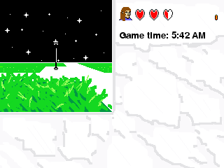
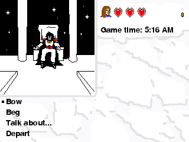

# What is "dirt"?
A first-person, turn-based adventure game written in Pygame.

## Dependencies
This game just depends on Python and Pygame.
I test the game with these specific versions:

* Python 3.5.3
* Pygame 1.9.3

## Running
Just execute dirt.py using your Python interpreter
(and make sure Pygame is installed)!

## Screenshots

## License
Copyright (C) 2017 Chris Murphy and Charlie Murphy

This program is free software: you can redistribute it and/or modify
it under the terms of the GNU General Public License as published by
the Free Software Foundation, either version 3 of the License, or
(at your option) any later version.

This program is distributed in the hope that it will be useful,
but WITHOUT ANY WARRANTY; without even the implied warranty of
MERCHANTABILITY or FITNESS FOR A PARTICULAR PURPOSE.  See the
GNU General Public License for more details.

You should have received a copy of the GNU General Public License
along with this program.  If not, see <http://www.gnu.org/licenses/>.

